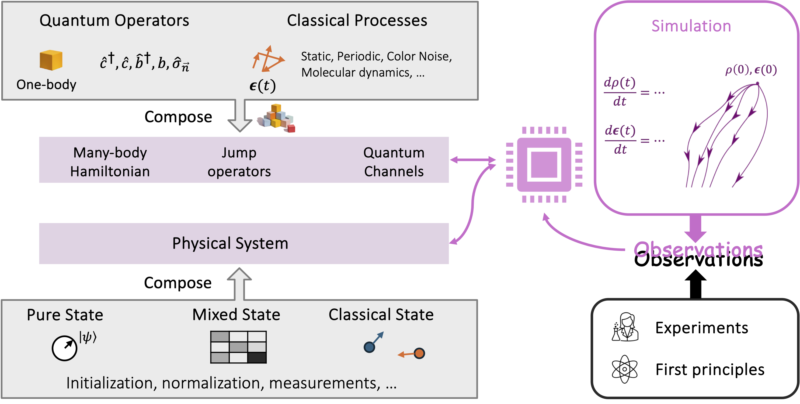

# QEpsilon

## About QEpsilon
QEpsilon is a Python package for modeling open quantum system. QEpsilon is designed to minimize the effort required to build data-driven quantum master equation of an open quantum system and to perform time evolution of the master equation. Applications of QEpsilon span from artificial quantum systems (qubits) to molecular systems. 

## QEpsilon in a nutshell
The quantum master equation modeled by QEpsilon is:

$$
\frac{d}{dt} \rho(t) = -i[H_{\epsilon}(t), \rho(t)] + \sum_{k} \gamma_k \left( L_k \rho(t) L_k^\dagger - \frac{1}{2} \{L_k^\dagger L_k, \rho(t)\}\right)
$$

Where:

- $\rho(t)$ is the density matrix of the system
- $H(t)$ is the time-dependent system Hamiltonian
- $L_k$ are the Lindblad operators describing the system-environment coupling

$H_{\epsilon}(t) = H_0 + H_c(t) + \sum_{j=1}^{M} f_j(\epsilon(t)) S_j$ is a linear combination of the static system Hamiltonian $H_0$, the external control $H_c(t)$, and perturbing Hermitian operators $S_j$.

$f_j(\epsilon(t))$ is a scalar function of the multidimensional, classical dynamical processes $\epsilon(t)$ that encodes information about the environment.

The classical dynamics of $\epsilon(t)$, described by parameterized Markovian equations of motion, can be optimized together with other system parameters (such as $\gamma_k$) through chain rules, and the behavior of $\rho_{\epsilon}(t)$ can match time-series data of the system.

QEpsilon provides a flexible framework to do such optimization and to perform time evolution of the master equation. See the figure below for a high-level overview of the architecture of QEpsilon.

  

## Highlighted features
- **General and flexible**, supporting the parameterization and simulation of spin, fermionic, bosonic  systems and their combinations. 
- **GPU and sparse linear algebra supports**, making it efficient to simulate relatively large quantum systems (~20 spins or several bosonic modes). 
- **highly modularized**, easy to implement many-body operators. 

## Installation
See the installation guide in the documentation.

## Tutorials
See the tutorials in the documentation.

## Examples
See `examples` folder in the repository.

## Credits

Please cite <a href="https://arxiv.org/abs/2508.17170">[arXiv:2508.17170]</a> for any use of QEpsilon.

## Copyright
QEpsilon Copyright (c) 2025, The Regents of the University of California,
through Lawrence Berkeley National Laboratory (subject to receipt of
any required approvals from the U.S. Dept. of Energy). All rights reserved.

If you have questions about your rights to use or distribute this software,
please contact Berkeley Lab's Intellectual Property Office at IPO@lbl.gov.

NOTICE.  This Software was developed under funding from the U.S. Department
of Energy and the U.S. Government consequently retains certain rights.  As
such, the U.S. Government has been granted for itself and others acting on
its behalf a paid-up, nonexclusive, irrevocable, worldwide license in the
Software to reproduce, distribute copies to the public, prepare derivative 
works, and perform publicly and display publicly, and to permit others to do so.