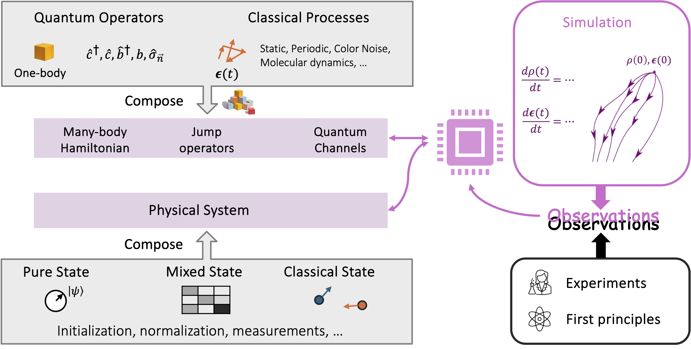

Tutorial
==================

Basic Concepts
---------------

QEpsilon is built around several key concepts:

* **Operators**: Quantum operators in second-quantization formalism. Operators can be one-body operators or many-body operators.
* **Systems**: Physical open quantum systems (many-body system consists of bosons, electrons, qubits, etc.) with a Hamiltonian, a set of Lindblad operators, and a set of parameters.
* **Simulations**: Time evolution of quantum master equations.

A high-level overview of the architecture of QEpsilon is shown below:

   Architecture of QEpsilon

What is an operator in QEpsilon?
---------------------------------
In QEpsilon, a Hamiltonian is a sum of `OperatorGroups`. Each `OperatorGroup` is a collection of many-body operators, acting on the same physical system, with a time-dependent coefficients. 
And each many-body operator is a tensor product of one-body base operators. 

For example, a `OperatorGroup` can be a collection of many-body spin operators expressed in the Pauli basis. It can represent, for example, :math:`\epsilon(t) (a_1 \sigma^x_1 \otimes \sigma^x_2 + a_2 \sigma^y_1 \otimes \sigma^y_2)`.  
The scalar variable :math:`\epsilon(t)` can be either static or time-dependent. The parameters within :math:`\epsilon(t)` can be trained on data. Meanwhile, the scalar :math:`a_1` and :math:`a_2` are fixed prefactors of the operators. They can not be trained after initialization.

**Alphabet of one-body base operators**

There are currently three types of base operators underlying `OperatorGroup`: Pauli operators (e.g. :math:`\sigma^x, \sigma^y, \sigma^z`), bosonic creation/annihilation operators (e.g. :math:`b^\dagger, b`), and tight-binding hopping operators (e.g. :math:`c^\dagger_i c_j`). 
We have an alphabet for each type of base operators, such that a one-body operator can be specified as a letter in the alphabet. 

- For spin systems, the alphabet is "I" (identity), "X" (Pauli-X), "Y" (Pauli-Y), "Z" (Pauli-Z), "U" (raising), "D" (lowering), "N" (number operator).

- For bosonic systems, the alphabet is "U" (Creation, i.e. raising), "D" (Annhilation, i.e. lowering), "I" (identity), "N" (number operator).

- For tight-binding systems, the alphabet is "X" (Do nothing), "L" (hopping to the left), "R" (hopping to the right), "N" (number operator).

These alphabets are defined in the `operator_basis` module. 

With these alphabets, a many-body operator can be denoted as a string of letters in the alphabet. For example, we can denote the Pauli operator :math:`\sigma^x_1 \otimes \sigma^x_2` as "XX".

**OperatorGroup: initialization**

A `OperatorGroup` should be initialized with size of the many-body system, a unique identifer (ID), and a batchsize for sampling :math:`\epsilon(t)`. 
Then, the `OperatorGroup` can be equipped with a list of operators by calling `OperatorGroup.add_operator` with a string of letters in the alphabet.

Users do not always need to build a `OperatorGroup` from scratch. QEpsilon provides several pre-defined subclasses of `OperatorGroup` for typical physical systems, such as interacting two-level systems, quantum harmonic oscillators, and tight-binding chains.

**Example: a spin OperatorGroup with static coefficient**

The opetatorgroup :math:`\epsilon(t) (a_1 \sigma^x_1 \otimes \sigma^x_2 + a_2 \sigma^y_1 \otimes \sigma^y_2)` can be initialized with a static coefficient that is a constant :math:`\epsilon(t)=2.0`:

.. code-block:: python

   operator_group = StaticPauliOperatorGroup(n_qubits=2, id="sigma_x_sigma_x", batchsize=1, coef=2.0, requires_grad = False)
   operator_group.add_operator("XX", prefactor=1.0)
   operator_group.add_operator("YY", prefactor=1.0)

`StaticPauliOperatorGroup` is a subclass of `OperatorGroup`. 
The operator :math:`a_1 \sigma^x_1 \otimes \sigma^x_2` is added to the originaly empty `OperatorGroup` by calling `add_operator` with :math:`a_1=1.0`.
The operator :math:`a_2 \sigma^y_1 \otimes \sigma^y_2` is added to the originaly empty `OperatorGroup` by calling `add_operator` with :math:`a_2=1.0`.

`requires_grad` is a boolean flag to indicate whether the coefficient :math:`\epsilon(t)` is a trainable parameter. If it is `True`, the coefficient can be optimized later, together with other parameters in the system. If it is `False`, the coefficient will be fixed.

`add_operator` can be called multiple times to add more operators to the `OperatorGroup`. The specification of the operators is a string of Pauli operator names by the convention of the Pauli operator basis. 
Obviously, "XX" means :math:`\sigma^x_1 \otimes \sigma^x_2`, "XY" means :math:`\sigma^x_1 \otimes \sigma^y_2`, etc.

**Example: a spin OperatorGroup with time-dependent coefficient**

One can also initialize a `OperatorGroup` with a time-dependent coefficient. For example, the Pauli opetator mentioned above can be initialized with a time-dependent coefficient :math:`\epsilon(t)` that is a white noise:

.. code-block:: python

   operator_group = WhiteNoisePauliOperatorGroup(n_qubits=2, id="xx_noise", batchsize=1, amp=0.0001, requires_grad = True)
   operator_group.add_operator("XX", prefactor=1.0)
   operator_group.add_operator("YY", prefactor=1.0)

`WhiteNoisePauliOperatorGroup` is a subclass of `OperatorGroup`. 
The `amp` is the amplitude of the white noise. Because here we let `requires_grad = True`, the amplitude becomes a trainable parameter that can be optimized later, together with other parameters in the system.

**Example: quantum harmonic oscillator**

One can initialize a `OperatorGroup` for a quantum harmonic oscillator as :math:`H = \sum_{i=1}^{N_{max}} \omega (b^\dagger b + 1/2)`:

Note that we can not accomodate infinitely many energy levels in numerical simulations. Therefore, when working with bosonic modes, we always need to truncate the number of energy levels to a finite number :math:`N_{max}`.

.. code-block:: python

   operator_group = HarmonicOscillatorBosonOperatorGroup(num_modes=1, id="boson_harmonic", batchsize=1, nmax=10, omega = 1.0)

**Advanced feature: Composite OperatorGroup for general systems**

The two examples given above uses pre-defined subclass of `OperatorGroup`: `StaticPauliOperatorGroup` and `WhiteNoisePauliOperatorGroup`.
Often, there are more complex operators that are not implemented in QEpsilon. For example, you may be dealing with a system with operator groups involving both spin and boson operators.
For these general situations, you can create a `Composite OperatorGroup` by yourself. This is a powerful feature of QEpsilon that provides the flexibility to study many different open quantum systems. 
The `Composite OperatorGroup` is a subclass of `OperatorGroup`. It is initialized with a list of `OperatorGroup`.
For example, a `Composite OperatorGroup` for a system with both spin and boson operators can be initialized as:

.. code-block:: python

   ##
   batchsize = 1
   spin_boson_coupling = 1.0
   nmax = 10

   ## spin_z is a one-body spin operator
   spin_z = StaticPauliOperatorGroup(n_qubits=1, id="spinz", batchsize=batchsize, coef=1.0, requires_grad=False) 
   spin_z.add_operator('Z')  

   ## boson_x is a boson operator (b^\dagger + b)
   boson_x = StaticBosonOperatorGroup(num_modes=1, id="boson_x", nmax=10, batchsize=batchsize, coef= spin_boson_coupling, requires_grad=False)   # gw(b^\dagger + b)
   boson_x.add_operator('U')
   boson_x.add_operator('D') 

   spin_boson_coupling = ComposedOperatorGroups(id="spin_boson_couple", OP_list=[spin_z, boson_x])

Here, we first define a spin-z operator :math:`\sigma^z` and a boson operator :math:`b^\dagger + b`. Then, we compose them into `Composite OperatorGroup` with the ID "spin_boson_couple" and the expression :math:`\sigma^z \otimes (b^\dagger + b)`.

How to define a quantum/classical state?
-----------------------------------------------------

Because QEpsilon is made for mixed quantum classical simulations. It implements multiple type of states of a physical system:

- Density matrix: the density matrix of a mixed or pure quantum state.
- Pure quantum state: the wavefunction of a pure quantum state.
- Classical particles: the positions and momenta of classical particles.

These states are implemented in the `system` module.

**Density matrix**

The parent class of density matrix is `DensityMatrix`. It is initialized with the number of states and the batchsize. 
For example, a density matrix of a two-level qubit system can be initialized as:

.. code-block:: python

   import torch as th
   from qepsilon import DensityMatrix
   density_matrix = DensityMatrix(num_states=2, batchsize=1)
   rho = th.tensor([[1.0, 0.0], [0.0, 1.0]], dtype=th.cfloat)
   density_matrix.set_rho(rho)

The density matrix is a complex tensor of shape (batchsize, num_states, num_states). 
`DensityMatrix` does not restrict the type of the underlying physical system, which can be spin-like, bosonic, or mixed-type. Essentially, it is just a wrapper of a complex tensor.

`DensityMatrix` has a setter function `set_rho` to set the density matrix, and a getter function `get_rho` to get the density matrix.
`DensityMatrix` has a property `trace` to get the trace of the density matrix.
`DensityMatrix` has a method `normalize` to normalize a given density matrix (it does not update the stored density matrix automatically).

*Subclass of `DensityMatrix`*

A subclass of `DensityMatrix` is `QubitDensityMatrix`. It is initialized with the number of qubits and the batchsize. 
It is used to represent the density matrix of a finite number of 2-level qubits. 
It has a few dedicated methods such as `set_rho_by_config` to set the density matrix by a configuration vector, 
`partial_trace` to perform a partial trace with respect to a subset of qubits, 
`apply_unitary_rotation` to apply a unitary rotation on a selected subset of qubits, 
and `observe_paulix_one_qubit` to observe the Pauli-X operator of one qubit.

**Pure quantum state**

The parent class of pure quantum state is `PureStatesEnsemble`. It is initialized with the number of states and the batchsize.
For example, a pure state ensemble of a two-level qubit system can be initialized as:

.. code-block:: python

   from qepsilon import PureStatesEnsemble
   pure_states_ensemble = PureStatesEnsemble(num_states=2, batchsize=1)
   pse = th.tensor([1.0, 0.0], dtype=th.cfloat)
   pure_states_ensemble.set_pse(pse)

The pure states ensemble is a complex tensor of shape (batchsize, num_states).
`PureStatesEnsemble` has a setter function `set_pse` to set the pure states ensemble, and a getter function `get_pse` to get the pure states ensemble.
`PureStatesEnsemble` has a method `normalize` to normalize a given pure states ensemble (it does not update the stored pure states ensemble automatically).
`PureStatesEnsemble` has a method `get_expectation` to get the expectation of an operator (a plain square matrix, not an `OperatorGroup`) on the pure states ensemble.

*Subclass of `DensityMatrix`*

So far, there are two subclasses of `PureStatesEnsemble`: `TightBindingPureStatesEnsemble` and `QubitPureStatesEnsemble`.

They are used to represent the pure states ensemble of tight-binding systems and qubit systems, with a few dedicated methods for convenience.

**Classical particles**

The parent class of classical particles is `Particles`. 
It is initialized with the number of particles, the batchsize, the dimension of the space, the mass of the particles, and optionally also the time step for their dynamical evolution.
For example, a classical particles system of two particles in 3D space can be initialized as:

.. code-block:: python

   from qepsilon import Particles
   particles = Particles(n_particles=2, batchsize=1, ndim=3, mass=1.0, dt=0.1)
   positions = th.tensor([[0.0, 0.0, 0.0], [1.0, 1.0, 1.0]], dtype=th.float32)
   particles.set_positions(positions)
   particles.set_gaussian_velocities(temp=300.0)  ## default temperature unit is Kelvin

`Particles` has a setter function `set_positions` to set the positions of the particles, and a setter function `set_gaussian_velocities` to set the velocities of the particles as a Gaussian distribution.
`Particles` has a getter function `get_positions` to get the positions of the particles, and a getter function `get_velocities` to get the velocities of the particles.
`Particles` has a method `modify_forces` to modify the forces on the particles.

*Classical Molecular Dynamics of Particles*

`Particles` has a method `step_langevin` to perform a Langevin dynamics step. 
It updates the positions and velocities of the particles by one time step with force, damping, and white noise.
The force is stored as ``particles.forces``. It can be reset to zero by calling ``particles.zero_forces()``. 
And it can be modified by calling ``particles.modify_forces``.

`Particles` has a method `step_adiabatic` to perform an adiabatic dynamics step. 
It updates the positions and velocities of the particles by one time step with leapfrog method, using the force stored in ``particles.forces``.

How to simulate a physical system? (the real deal)
--------------------------------------------------

The 
Eventually, we would like to simulate the dynamics of the states of a physical system. 
The dynamics are governed by a set of equation of motion, which is a master equation for open quantum systems, 
a Schrödinger equation for closed quantum systems, or a classical molecular dynamics for classical particles.

 

Here's a simple example to get you started with a two-level system (TLS):

.. code-block:: python

   import qepsilon as qe
   import numpy as np

   # Create a two-level system
   tls = qe.TLS()
   
   # Define the system parameters
   omega = 1.0  # Energy splitting
   gamma = 0.1  # Decay rate
   
   # Create operators
   H = omega * tls.sigma_z()  # Hamiltonian
   L = np.sqrt(gamma) * tls.sigma_minus()  # Lindblad operator
   
   # Set up the simulation
   sim = qe.LindbladSystem(hamiltonian=H, lindblad_operators=[L])
   
   # Define initial state (excited state)
   rho_0 = tls.excited_state()
   
   # Time evolution
   times = np.linspace(0, 10, 100)
   results = sim.evolve(rho_0, times)
   
   print("Simulation completed!")

Working with Different Systems
-------------------------------

Spin Systems
~~~~~~~~~~~~~

.. code-block:: python

   # Create a spin-1/2 system
   spin = qe.SpinSystem(n_sites=2, spin=0.5)
   
   # Heisenberg interaction
   J = 1.0
   H = J * (spin.Sx(0) @ spin.Sx(1) + 
            spin.Sy(0) @ spin.Sy(1) + 
            spin.Sz(0) @ spin.Sz(1))

Bosonic Systems
~~~~~~~~~~~~~~~~

.. code-block:: python

   # Create a bosonic mode
   boson = qe.BosonSystem(n_modes=1, max_occupation=10)
   
   # Harmonic oscillator
   omega = 1.0
   H = omega * boson.number_operator(0)

Tight-Binding Systems
~~~~~~~~~~~~~~~~~~~~~~

.. code-block:: python

   # Create a tight-binding chain
   tb = qe.TightBindingSystem(n_sites=4)
   
   # Hopping Hamiltonian
   t = 1.0
   H = -t * sum(tb.c_dag(i) @ tb.c(i+1) + tb.c_dag(i+1) @ tb.c(i) 
                for i in range(3))

Setting Up Master Equations
----------------------------

Lindblad Master Equation
~~~~~~~~~~~~~~~~~~~~~~~~~

For open quantum systems with Markovian dynamics:

.. code-block:: python

   # Define system and environment
   system = qe.TLS()
   
   # Hamiltonian
   H = omega * system.sigma_z()
   
   # Lindblad operators for different processes
   L_decay = np.sqrt(gamma) * system.sigma_minus()  # Spontaneous emission
   L_dephasing = np.sqrt(gamma_phi) * system.sigma_z()  # Pure dephasing
   
   # Create the master equation
   sim = qe.LindbladSystem(
       hamiltonian=H,
       lindblad_operators=[L_decay, L_dephasing]
   )

Unitary Evolution
~~~~~~~~~~~~~~~~~~

For closed quantum systems:

.. code-block:: python

   # Unitary evolution (no decoherence)
   sim = qe.UnitarySystem(hamiltonian=H)

Time-Dependent Hamiltonians
~~~~~~~~~~~~~~~~~~~~~~~~~~~~

.. code-block:: python

   # Time-dependent driving
   def H_t(t):
       return omega * system.sigma_z() + A * np.cos(omega_drive * t) * system.sigma_x()
   
   sim = qe.LindbladSystem(hamiltonian=H_t, lindblad_operators=[L_decay])

Running Simulations
--------------------

Basic Time Evolution
~~~~~~~~~~~~~~~~~~~~~

.. code-block:: python

   # Initial state
   rho_0 = system.ground_state()
   
   # Time points
   times = np.linspace(0, 10, 1000)
   
   # Evolve
   results = sim.evolve(rho_0, times)
   
   # Extract observables
   population = [np.real(np.trace(rho @ system.sigma_z())) for rho in results]

GPU Acceleration
~~~~~~~~~~~~~~~~~

For large systems, use GPU acceleration:

.. code-block:: python

   import torch
   
   # Move to GPU
   sim = sim.to('cuda')
   rho_0 = rho_0.to('cuda')
   
   # Run on GPU
   results = sim.evolve(rho_0, times)

Next Steps
-----------

* Explore the :doc:`examples/index` section for more detailed examples
* Check the :doc:`api/index` for complete API reference
* Read about the :doc:`theory` behind QEpsilon

For more advanced usage, see the examples in the ``examples/`` directory of the repository. 