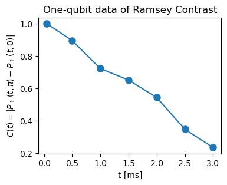
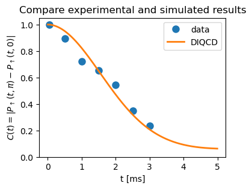

Tutorial: Training
====================
 
Introduction
------------

This tutorial demonstrates how to train a data-informed quantum-classical dynamics (DIQCD) model using QEpsilon. 
QEpsilon provides a simulation-based method to train the parameters of a quantum system from experimental or simulation data.

Basically, the training process involves the following steps:

- Define the physical system (Hamiltonian, jumping operators, etc.) like how you define the system in the :doc:`tutorial_simulation` section. But remember to specify that `requires_grad=True` for those operators that are to be trained. Keep `requires_grad=False` for those operators that are known a priori.

- Simulate the system dynamics like how your (actual or numerical) experiments are performed. Make measurements at those time steps that you have data for.

- Calculate the loss function between the simulated data and the experimental data.  You can use any metric you like. For example, you can use the mean squared error (MSE) between the simulated data and the experimental data.

- Do a standard optimization procedure to minimize the loss function.

Example: Two-level system
-------------------------
  
Here we demonstrate how to train a DIQCD model for a one-qubit system, with data from a Ramsey experiment.

The Ramsey experiment is a standard experiment to measure the coherence time of a qubit.
The Ramsey experiment is performed by applying a pi/2 rotation along the x-axis, then free evolution for a time :math:`t`, 
and then applying a pi/2 rotation along another axis (flexible, denoted by :math:`u` in the following).

The observation is performed by measuring the probability of being in the state :math:`|0\rangle` (spin-up) at the end of the experiment. 
Let this probability be denoted by :math:`P_{\uparrow}(t,\theta)`.

Let :math:`u=(cos(\theta), sin(\theta), 0)`. We define the Ramsey contrast as :math:`C(t) = |P_{\uparrow}(t,\theta=\pi) - P_{\uparrow}(t,\theta=0)|`.

Below is a set of data of Ramsey contrasts extracted from Holland et al., Science 382, 1143–1147 (2023). The Ramsey contrasts are preprocessed to eliminate preperation errors.
 
.. code:: ipython3

    ## a simple time series data of Ramsey experiments. Ramsey contrasts are measured for T=0.05ms, 0.5ms, 1.0ms, 1.5ms, 2.0ms, 2.5ms, 3.0ms
    measure_t = [0.0500, 0.5000, 1.0000, 1.5000, 2.0000, 2.5000, 3.0000]
    measure_C = [1.0000, 0.8958, 0.7227, 0.6518, 0.5439, 0.3473, 0.2354]
    fig, ax = plt.subplots(figsize=(4,3))
    ax.plot(measure_t, measure_C, markersize=8, marker='o')
    ax.set_xlabel('t [ms]')
    ax.set_ylabel(r'$C(t)=|P_{\uparrow}(t,\pi) - P_{\uparrow}(t,0)|$')
    ax.set_title('One-qubit data of Ramsey Contrast')
    plt.show()
    plt.close()

Let us then establish a DIQCD model to fit the data.

.. code:: ipython3

    import numpy as np
    import torch as th
    import qepsilon as qe
    from matplotlib import pyplot as plt

.. code:: ipython3

    batchsize = 256
    qubit = qe.QubitLindbladSystem(n_qubits=1, batchsize=batchsize)
    qubit.set_rho_by_config([0])

.. code:: ipython3

    sz_shot = qe.ShotbyShotNoisePauliOperatorGroup(n_qubits=1, id="sz_noise_shot", batchsize=batchsize, amp=0.1, requires_grad=True)
    sz_shot.add_operator('Z')
    qubit.add_operator_group_to_hamiltonian(sz_shot)
    
    sx_jump = qe.StaticPauliOperatorGroup(n_qubits=1, id="sx_jump", batchsize=batchsize, coef=0.01, static=False,requires_grad=True)
    sx_jump.add_operator('X')
    qubit.add_operator_group_to_jumping(sx_jump)

Up to this point, what we do is almost the same as how we define the qubit Lindblad system in the :doc:`tutorial_simulation` section.
The only difference is that we set `requires_grad=True` for both Hamiltonian and jumping operators.

Next, we set the simulation and training parameters.

.. code:: ipython3

    dt=0.005 ## time step
    T=4 ## total simulation time
    nsteps = int(T/dt)
    observe_steps = [int(t / dt) for t in measure_t]  ## do measurement at these time steps 
    nepoch = 100  ## total training epoches
    optimizer = th.optim.Adam([{'params': qubit.HamiltonianParameters(), 'lr': 0.03},
                              {'params': qubit.JumpingParameters(), 'lr': 0.001}])

The meaning of these parameters are self-explanatory. At the end, we set a ADAM optimizer for the parameters in the DIQCD model. 
`HamiltonianParameters()` is the set of all the trainable parameters in the Hamiltonian, 
and `JumpingParameters()` is the set of all the trainable parameters in the jumping operators.

Now, we are ready to perform simulation, compare with the data, and train the model, in an iterative manner.

.. code:: ipython3

    for epoch in range(nepoch):
        ## reset system state
        qubit.reset()
        qubit.set_rho_by_config([0])
        prob_up_list = []  ## for storing the measurement results
        
        # apply first pi/2 rotation along x
        qubit.rotate(direction=th.tensor([1.0,0,0]), angle=np.pi/2)
        
        # free evolution and measurement
        for i in range(nsteps):
            qubit.step(dt=dt)
            if i in observe_steps:
                for theta in [0, np.pi]:
                    # define the axis for applying the last pulse
                    u = th.tensor([np.cos(theta), np.sin(theta), 0.0], dtype=th.float)
                    # apply the second pi/2 rotation along the direction u
                    dm = qubit.density_matrix
                    current_rho = dm.apply_unitary_rotation(qubit.rho, u, np.pi/2)
                    # observe the probability of being in the state |0>  (spin-up)
                    prob_up = dm.observe_prob_by_config(current_rho, th.tensor([0]))
                    prob_up_list.append(prob_up.mean())
                    
        ## calculate loss and step optimizer
        prob_up_list = th.stack(prob_up_list).reshape(len(observe_steps), 2)
        Ramsey_Contrast = th.abs(prob_up_list[:, 1] - prob_up_list[:, 0])
        loss = ((Ramsey_Contrast - th.tensor(measure_C)) ** 2).mean()
        optimizer.zero_grad()
        loss.backward()
        optimizer.step()
    
        if epoch % 10 == 0:
            print('Epoch={}, Loss={}'.format(epoch, loss))
            print('Simulated Ramsey Contrast:', Ramsey_Contrast.detach().numpy())

The training quickly converges to a good fit. Output is shown below.

.. parsed-literal::

    Epoch=0, Loss=0.13371221721172333
    Simulated Ramsey Contrast: [0.9999263  0.9945936  0.97892886 0.9534482  0.91886765 0.8761416
     0.8264214 ]
    Epoch=10, Loss=0.10416834056377411
    Simulated Ramsey Contrast: [0.999856   0.9912077  0.96643484 0.9270018  0.87496626 0.81293535
     0.7438406 ]
    Epoch=20, Loss=0.03927537053823471
    Simulated Ramsey Contrast: [0.9996637  0.97956324 0.9235978  0.83931565 0.7365615  0.6254713
     0.51449037]
    Epoch=30, Loss=0.011041725054383278
    Simulated Ramsey Contrast: [0.9994703  0.9691173  0.8858475  0.7633902  0.6198219  0.47379768
     0.3406668 ]
    Epoch=40, Loss=0.005107288248836994
    Simulated Ramsey Contrast: [0.9991515  0.94778126 0.81110644 0.6247592  0.4319702  0.26973945
     0.15821564]
    Epoch=50, Loss=0.006070218048989773
    Simulated Ramsey Contrast: [0.99913985 0.94839346 0.8131318  0.626911   0.43046987 0.2592173
     0.13389939]
    Epoch=60, Loss=0.0035872850567102432
    Simulated Ramsey Contrast: [0.9992665  0.9583786  0.84986055 0.6995914  0.53755385 0.38852668
     0.26703283]
    Epoch=70, Loss=0.0028746577445417643
    Simulated Ramsey Contrast: [0.99916273 0.9496452  0.819366   0.6445786  0.46642804 0.31605113
     0.2062841 ]
    Epoch=80, Loss=0.0030608363449573517
    Simulated Ramsey Contrast: [0.9991818  0.95154196 0.8250345  0.65181637 0.47051635 0.31374782
     0.19886565]
    Epoch=90, Loss=0.003072070423513651
    Simulated Ramsey Contrast: [0.9992282  0.9563436  0.8414374  0.6795628  0.50178504 0.3365388
     0.2025435 ]

We are done. Below, we do a final simulation, with dense sampling of :math:`t`, to compare the simulated results with the experimental data.

.. code:: ipython3

    qubit.reset()
    qubit.set_rho_by_config([0])
    prob_up_list = []  ## for storing the measurement results
    nsteps = int(5/dt)
    with th.no_grad():
        # apply first pi/2 rotation along x
        qubit.rotate(direction=th.tensor([1.0,0,0]), angle=np.pi/2)
        # free evolution and measurement
        for i in range(nsteps):
            qubit.step(dt=dt)
            for theta in [0, np.pi]:
                # define the axis for applying the last pulse
                u = th.tensor([np.cos(theta), np.sin(theta), 0.0], dtype=th.float)
                # apply the second pi/2 rotation along the direction u
                dm = qubit.density_matrix
                current_rho = dm.apply_unitary_rotation(qubit.rho, u, np.pi/2)
                # observe the probability of being in the state |0>  (spin-up)
                prob_up = dm.observe_prob_by_config(current_rho, th.tensor([0]))
                prob_up_list.append(prob_up.mean())
                
    prob_up_list = th.stack(prob_up_list).reshape(-1, 2)
    Ramsey_Contrast = th.abs(prob_up_list[:, 1] - prob_up_list[:, 0])
    fig, ax = plt.subplots(figsize=(4,3))
    ax.plot(measure_t, measure_C, markersize=8, marker='o', linewidth=0, label='data')
    ax.plot(np.arange(Ramsey_Contrast.shape[0])*dt, Ramsey_Contrast.numpy(), linewidth=2, label='DIQCD')
    ax.set_ylim(0, 1.05)
    
    ax.set_xlabel('t [ms]')
    ax.set_ylabel(r'$C(t)=|P_{\uparrow}(t,\pi) - P_{\uparrow}(t,0)|$')
    ax.set_title('Compare experimental and simulated results')
    ax.legend()
    plt.show()
    plt.close()

Next Steps
-----------

* Explore the :doc:`examples` sections for advanced examples
* Check the :doc:`api/index` for complete API reference
   